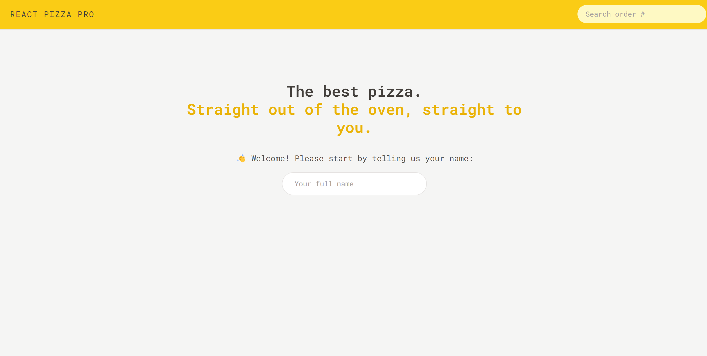
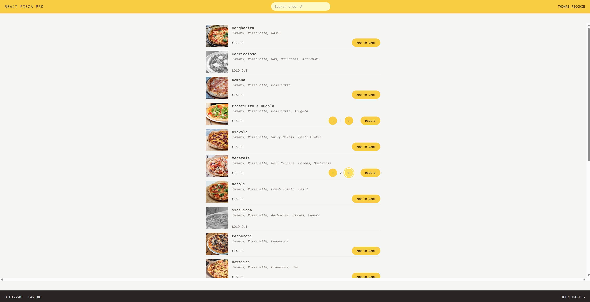
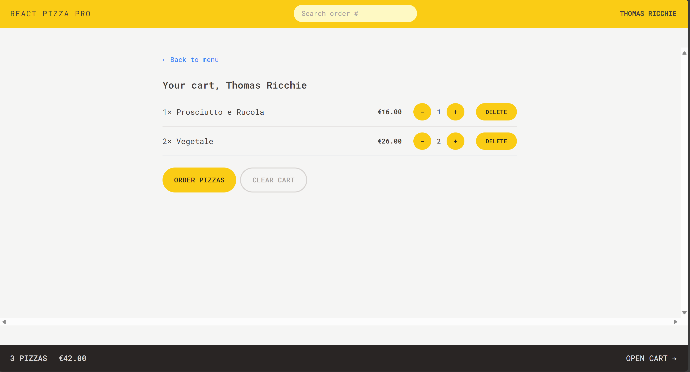
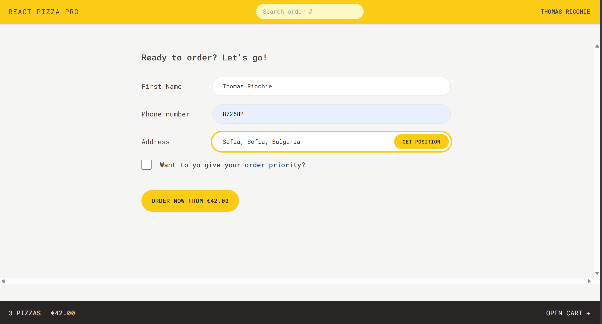
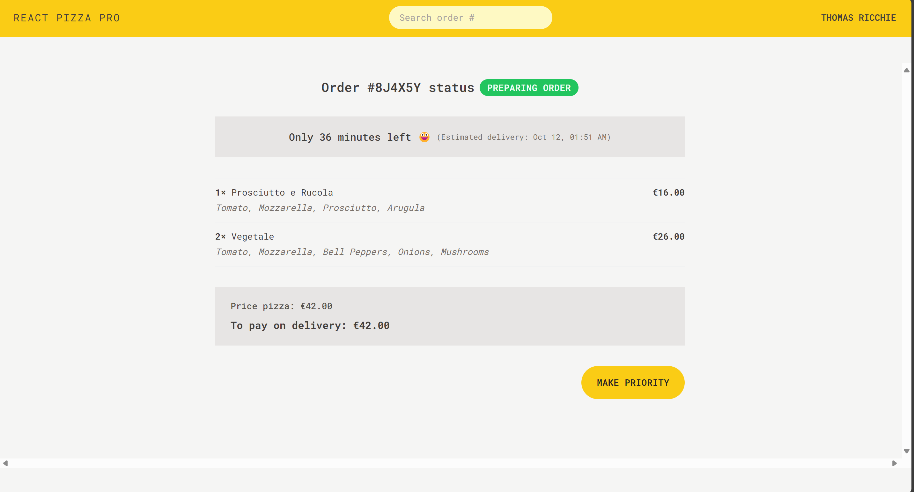

# react-pizza-pro

**Disclaimer**: This project is based on the [The Ultimate React Course 2024: React, Next.js, Redux & More](https://www.udemy.com/course/the-ultimate-react-course/) Jonas Schmedtmann's course (project 1 from section Part 4: Professional React Development). The primary purpose of this repository is for personal learning and practice. All credit for the original design and concepts goes to Jonas Schmedtmann. This repository serves as my implementation of the project following the course.

## Overview
Welcome to Pizza Pro! You can easily order your favorite pizzas without the need for complicated registrations. Simply enter your name, select the pizza/s you want, and provide your first name, phone number, and delivery address to complete your order. You can even set a priority for faster service. Pizza Pro makes ordering delicious pizza simple and quick—perfect for when you're hungry and don't want any hassle!

## Technologies Used
- React
- Tailwind CSS
- Redux

## How to Run the Project
1. Install the packages
```
npm install
```
2. Run the application
```
npm run dev
```

### Usage

- **Home page**
<br />This is where you begin. Enter your name to access the pizza menu. You can also search for existing orders by entering a code. A simple and quick way to start ordering your favorite pizzas!


- **Menu page**
<br />Explore all available pizzas here! Each pizza is displayed with a photo, name, description, and price. Add pizzas to your cart, adjust quantities, or view sold-out items. You can also track your order details and total price before heading to checkout or searching orders by code.


- **Cart Page**
<br />Review your selected pizzas and finalize your order here. You can adjust quantities, remove items, or clear your entire cart. Ready to order? Hit the "Order Pizzas" button, or return to the menu to make changes!


- **Order Page**
<br />Finalize your pizza order by entering your name, phone number, and address. Use the "Get Position" button for automatic address entry, and optionally mark your order as a priority. Click "Order now from (total price)" to complete your purchase.


- **Order Info Page**
<br />Track your order status here. See how many minutes are left until delivery, check the pizza details, and view the total payment due. You can also upgrade your order to priority with the "Make Priority" button. This page is also accessible by searching an order code.

